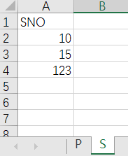

# SimpleSQLGenerator
 This repo contains 2 Python scripts to generate simple SQL scripts (`create table`and`insert into`) from easy-to-edit Excel files.

## SQLTableCreator
 Quick tool to generate SQL scripts that create tables from database design sheet
### Usage
 Put your database design sheet (shaped like the pic below) in the `.py` script directory
 
 And run `sqlTableCreator.py`, you'll get a text file output like 
 ```SQL
 create table P
(
PNO INT primary key not null foreign key references S(SNO),
);

create table S
(
SNO INT primary key ,
);
```


## SQLDataInserter
 Quick tool to generate SQL scripts that insert data according to a sheet
### Usage
 Put your data sheet (shaped like the pic below) in the `.py` script directory 

 
 And run `sqlDataInserter.py`, you'll get a text file output like 
 ```SQL
 insert into P
( PNO )
values
('15', ),


insert into S
( SNO )
values
('10', ),
('15', ),
('123', ),
```

