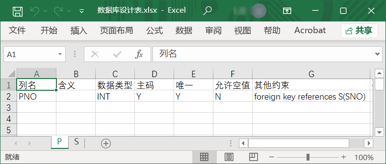

# SQLTableCreator
 Quick tool to generate simple SQL scripts that create tables from database design sheet
# Usage
 Put your database design sheet (shaped like the pic below) in the `.py` script directory
 
 And run the  `.py` script, you'll get a text file output like 
 ```SQL
 create table P
(
PNO INT primary key not null foreign key references S(SNO),
);

create table S
(
SNO INT primary key ,
);
```